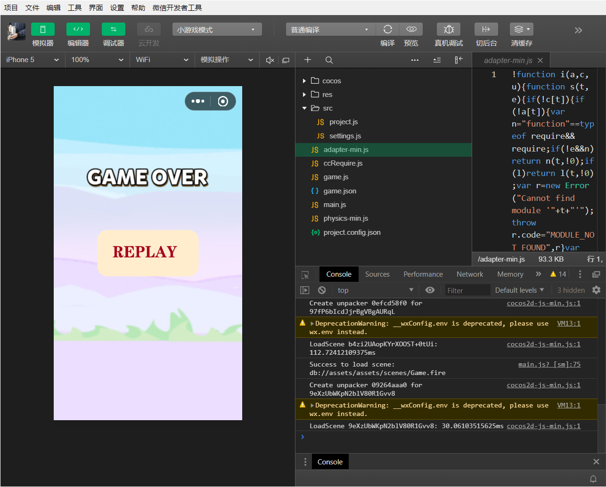
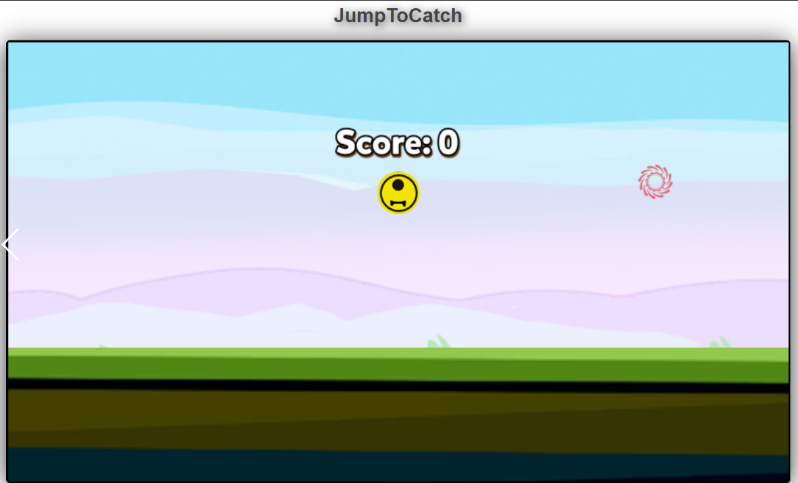
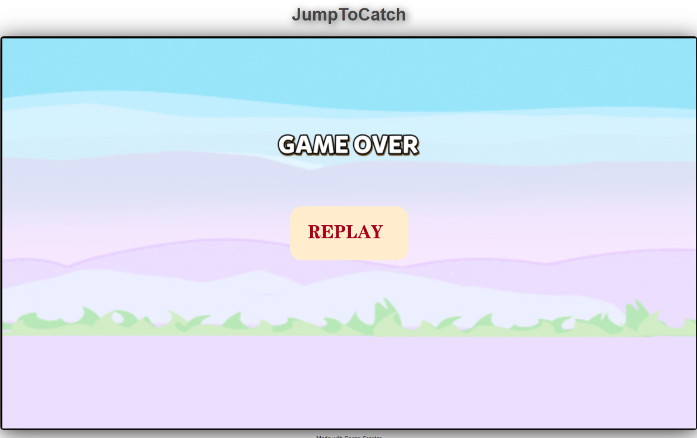

微信游戏*Jump To Catch*开发文档
===============================

开发团队：思考一下

队员：艾孜尔江·艾尔斯兰（程序方向）

蔡瑞佳（美术方向）

游戏背景
--------

该游戏作为一款以微信为平台的小游戏，在秉持着其简约性之外，更注重游戏难度的适中性，面向对象主要为有闲暇时间的3岁以上男女老少。该游戏作为程序开发者在程序开发过程中的冥思苦想的结果，在一定程度上融合了优质的美术资源，并将该游戏作为一款跨平台游戏进行发布，在最终的微信小游戏版本中进行了平台上的修改，以契合微信小游戏快、稳、轻等特点。

该游戏作为一款娱乐消遣性的游戏，能够一定程度上缓解玩家身心压力，驱散心情中的不快，尤其是当玩家在玩耍过程中看到分数随着撞击而不断升高的时候，更会发觉自己心中的烦恼已经被跑到九霄云外。

本次游戏的前期策划主要参考经典的《吃豆人》游戏，但是在其基础上又往轻量化方向进行改善，玩家在玩耍的过程中能够非常顺利地上手。

游戏特色
--------

本游戏采用简单的交互逻辑，无需玩家动用太多精力，只要用手指轻触手机屏幕让正在弹跳的小球触碰到即将消失的生命球，即可获得加分。在整体特色上采用简单轻快的游戏玩法，在交互设计上更是凸显了以用户为中心的根本宗旨，在让用户/玩家体验到真正轻松和愉悦。当一个个小球被击中，玩家随着得分的增加而感受到一股无与伦比的心理满足，同时也增加了逐渐消失的环节，让生命球随着事件的推移而逐渐变淡直至消失，当玩家没有能够及时触碰到生命球以获得弹跳能量的时候，也就意味着生命的结束。游戏创作者以此游戏，寓人生真谛——在人的生命历程中，需要我们不断地去奋进、去获得能够让我们永葆青春、永葆新鲜的那些养料，只有这样，我们才能够获得更加幸福，才不至于在时代的潮流中遭受淘汰。作者以此游戏为出发点
，向游戏玩家呈现轻快愉悦的娱乐方式之余，更向玩家暗语生命的真谛。

游戏玩法介绍
------------

游戏玩家通过手指滑动屏幕就能够有效地改变场景中地小球的运动状态和运动方向，在画面中随机产生的生命血条会根据时间的变化而逐渐变淡，久而久之就消失不见，当玩家没有在规定时间内获取到生命血条的时，游戏就会宣告结束。玩家的分数会实时显示在游戏场景中上方的积分板上。

交互设计
--------

在交互上，本游戏主要考虑到跨平台的特性，在一定程度上形成了以电脑主机为运行环境的键盘鼠标模式和以手机微信为运行环境的触屏模式。在触屏模式下，用户只需要用手机点击场景中想要去向的部位，就能够让场景中的小球向着该方位发生位移上的变化，进而在触碰到生命血条之后，完成本次游戏分数的获取。本跨平台游戏在电脑端的交互模式则使用键盘上的上下左右键进行，大体与上述内容类似。

[开发过程示意图]

[游戏进行时界面]

[游戏结束时界面]

美术设计
--------

在美术方面，整体的设计风格主要是服务于玩家可以更加简单方便的操作，减轻人们在生活中的压力。简单的操作与简单的画面相互配合使用，使得玩家更加简单的使用次小游戏，游戏玩家的年龄范围适用很广泛，老少皆宜，符合老年人可以活动手指预防老年疾病锻炼灵活与反应，又可以使得老年人很清晰地看到游戏的目标；还符合青少年以及上班族在繁忙的工作之余，用简单轻松的画风以减轻奋斗中的年轻人生活和工作压力。背景用极简的线条将其场景勾画出来，配以较为鲜艳颜色的目标物体和玩家操作小球，一改游戏繁复的操作界面，使得玩家能够更加清晰方便可操作此类小游戏。

开发详情
--------

#### 环境

1.  手机版微信；

2.  Windows 7/8/10。

#### 架构

本游戏采用Cocos
Creator引擎提供的帧渲染式架构，游戏的运行过程采用实时渲染在画布的方式进行，有效地提升了用户体验度。

#### 创意

本游戏的创意主要来自《吃豆人》，并将该创意进行梳理和删减，进而产生本游戏的alpha版本以供本次竞赛使用。同时也是作为本游戏程序开发者献给包括本游戏的美术开发者在内的普罗大众的一款跨平台横版闯关类娱乐消遣游戏。

#### 测试

本游戏的测试经由游戏开发者和美术设计者共同完成，分别在不同的手机上、不同环境下的电脑上运行并获取最后的测试结果作为性能优化的主要参考依据，进而在提高性能的基础上进行二次完善和开发，实现本次竞赛的最终成品——Jump
To Catch这款游戏。

鸣谢
----

在本次开发过程的前期和后期，要十分感谢支持和热心参与本次任务的搭档蔡瑞佳，没有她在前期讨论中的积极和主动就很难有本游戏现在的这个结果，没有她后期对美术上的完善，也很难让本游戏具有足够强的吸引力。

吃水不忘挖井人，开发团队也要由衷地感谢指导老师李宇彤老师对本次比赛开发过程中的支持与鼓励。

最后，更感谢组委会为我们提供的这次机会，让我们对微信小游戏有了进一步的认识的同时，更让我们制作出微信小游戏成品并参与到比赛当中。
